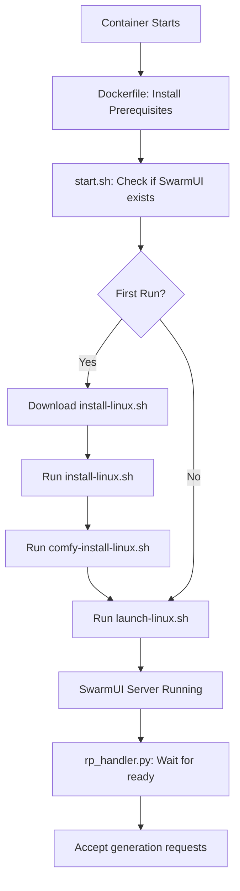

# Architecture - Simplified Approach

## Design Philosophy

**We don't reinvent the wheel.** This project uses SwarmUI's official installation and launch scripts instead of manual build processes. This approach is:

- **Simpler**: Less code to maintain
- **More reliable**: SwarmUI's scripts handle edge cases
- **Future-proof**: Automatically compatible with SwarmUI updates
- **Best practice**: Use official tooling instead of custom solutions

## How It Works

### First Run (20-30 minutes)

```bash
# 1. Download SwarmUI installer
wget https://github.com/mcmonkeyprojects/SwarmUI/releases/download/0.6.5-Beta/install-linux.sh

# 2. Run installer (clones, sets up SwarmUI)
./install-linux.sh

# 3. Install ComfyUI backend
./SwarmUI/launchtools/comfy-install-linux.sh nv

# 4. Launch SwarmUI
./SwarmUI/launch-linux.sh --launch_mode none --host 0.0.0.0
```

### Subsequent Runs (60-90 seconds)

```bash
# SwarmUI and ComfyUI already installed, just launch
./SwarmUI/launch-linux.sh --launch_mode none --host 0.0.0.0
```

### File Flow



## Key Files

### Dockerfile
- Installs prerequisites: Python 3.11, .NET 8, CUDA, git
- Copies handler and startup script
- **No manual SwarmUI installation**

### start.sh
- Checks if SwarmUI exists on volume
- First run: Downloads and runs official install scripts
- Always: Runs `launch-linux.sh` with proper flags
- **~50 lines instead of 200+**

### rp_handler.py
- Waits for SwarmUI API to respond
- Tests backend availability
- Handles image generation requests
- **~250 lines instead of 400+**

## Network Volume Structure

```
/runpod-volume/
├── SwarmUI/                    # Installed by official scripts
│   ├── launch-linux.sh         # Official launch script
│   ├── launchtools/            # Installation tools
│   │   └── comfy-install-linux.sh
│   ├── bin/                    # Built by launch script
│   ├── Data/                   # Settings
│   ├── dlbackend/              # ComfyUI backend
│   │   └── ComfyUI/
│   ├── Models/                 # Model storage
│   └── Output/                 # Generated images
└── install-linux.sh            # Downloaded on first run
```

## Why This Approach?

**Before (Manual):**
- Manual git clone
- Manual dotnet build commands
- Custom ComfyUI installation logic
- Symlink management
- Backend configuration files
- **Result**: 200+ lines of bash, fragile, hard to maintain

**After (Official Scripts):**
- Download and run `install-linux.sh`
- Run `comfy-install-linux.sh`
- Run `launch-linux.sh`
- **Result**: 50 lines of bash, reliable, maintainable

## Environment Variables

| Variable | Default | Purpose |
|----------|---------|---------|
| `VOLUME_PATH` | `/runpod-volume` | Network volume mount point |
| `SWARMUI_HOST` | `0.0.0.0` | Bind address |
| `SWARMUI_PORT` | `7801` | API port |
| `STARTUP_TIMEOUT` | `1800` | Max wait for first-time install (30 min) |
| `GENERATION_TIMEOUT` | `600` | Max generation time (10 min) |

## Cold Start Behavior

**First Run:**
1. Container starts ⚡
2. Downloads `install-linux.sh` (5s)
3. Runs installer → clones SwarmUI (2-3 min)
4. Runs `comfy-install-linux.sh` → installs PyTorch + ComfyUI (10-15 min)
5. Runs `launch-linux.sh` → builds and starts SwarmUI (3-5 min)
6. **Total: 20-30 minutes**

**Subsequent Runs:**
1. Container starts ⚡
2. Runs `launch-linux.sh` → starts existing SwarmUI (60-90s)
3. **Total: 60-90 seconds**

## API Example

```python
import requests

response = requests.post(
    "https://api.runpod.ai/v2/YOUR_ENDPOINT/runsync",
    headers={"Authorization": "Bearer YOUR_API_KEY"},
    json={
        "input": {
            "prompt": "a beautiful landscape",
            "model": "OfficialStableDiffusion/sd_xl_base_1.0",
            "width": 1024,
            "height": 1024,
            "steps": 30,
            "cfg_scale": 7.5
        }
    }
)

result = response.json()
images = result["output"]["images"]  # Base64 encoded
```

## Troubleshooting

**Issue: First start taking longer than 30 minutes**
- Check logs for download/install progress
- Verify network volume has 15GB+ free space
- Check internet connection from container

**Issue: "SwarmUI not ready" after timeout**
- Check if `launch-linux.sh` ran successfully
- Look for errors in SwarmUI logs
- Verify .NET 8 SDK is installed: `dotnet --version`

**Issue: "No backends available"**
- ComfyUI installation may have failed
- Check logs for `comfy-install-linux.sh` errors
- Verify Python 3.11: `python3.11 --version`

## Benefits of This Approach

✅ **Simplicity**: Minimal custom code
✅ **Reliability**: Uses tested official scripts
✅ **Maintainability**: Easy to update SwarmUI version
✅ **Compatibility**: Always matches SwarmUI's expectations
✅ **Best Practice**: Professional approach - use official tooling

---

**The Result**: Clean, simple, professional code that leverages SwarmUI's own installation system instead of reinventing it.
