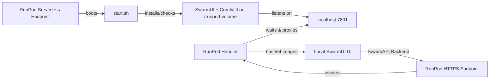

# RunPod SwarmUI Serverless Worker

Spin up **SwarmUI** on **RunPod Serverless** in minutes, keep your models on a persistent network volume, and connect from any SwarmUI frontend.

<p align="center">
  <a href="#quick-start">Quick Start</a> ·
  <a href="#features">Features</a> ·
  <a href="#requirements">Requirements</a> ·
  <a href="#documentation">Docs</a> ·
  <a href="#repository-structure">Repo Structure</a>
</p>

---

## Highlights

- **Serverless ready** – built on the official RunPod worker pattern, cold-start friendly.
- **Persistent storage** – installs SwarmUI and ComfyUI onto a RunPod network volume so models persist across workers.
- **Local + cloud hybrid** – connect your lightweight local SwarmUI UI to powerful GPUs in the cloud.
- **Production documentation** – quick start, setup guide, and deployment checklist included.

---

## Features

- **Automated bootstrap** – `start.sh` installs SwarmUI and ComfyUI on first run and reuses the installation thereafter.
- **Resilient handler** – `src/rp_handler.py` waits for SwarmUI, manages sessions, and returns images as base64.
- **Test tools** – `test_endpoint.py` validates your endpoint with either synchronous or asynchronous RunPod APIs.
- **Template friendly** – Docker image follows RunPod serverless expectations, ready for template publishing and credit earning.

---

## Requirements

- **RunPod account & credits** – at least $10 to get started.
- **Network volume** – attach a RunPod network storage volume sized for:
  - All **Stable Diffusion / SDXL / Flux** models you intend to host.
  - Any **ComfyUI custom nodes** or checkpoints you want persistent.
  - Recommended minimum: **100 GB**, more for large model libraries.
- **GPU selection** – e.g., RTX 4090 (24 GB) for SDXL, A100 (40 GB/80 GB) for larger or multiple models.
- **Python 3.11+** – required for the local test script.

> ⚠️ Without a mounted network volume, every cold start re-installs SwarmUI and re-downloads models. Attach storage before deployment.

---

## Quick Start

Follow the condensed flow below, or read the full quick start guide.

1. **Clone** the repo and optionally build/push your Docker image.
2. **Create** a RunPod network volume (≥100 GB) in your target region.
3. **Deploy** a serverless endpoint using this repo’s Docker image and attach the volume.
4. **Monitor logs** – first start takes ~20–30 minutes while SwarmUI + ComfyUI install to the volume.
5. **Test** with `python test_endpoint.py --endpoint <ID> --api-key <TOKEN>`.
6. **Connect** your local SwarmUI as a SwarmAPI backend pointing to `https://api.runpod.io/v2/<ENDPOINT_ID>`.

See `docs/QUICKSTART.md` for detailed commands and variations.

---

## Workflow Overview



---

## Documentation

- **Quick Start** – rapid install and test: `docs/QUICKSTART.md`
- **Setup Guide** – in-depth deployment, model uploads, and troubleshooting: `docs/SETUP.md`
- **Deployment Checklist** – step-by-step validation before you go live: `docs/DEPLOYMENT_CHECKLIST.md`

Additional references:

- RunPod worker handler: `src/rp_handler.py`
- Startup installer: `start.sh`
- Docker image definition: `Dockerfile`
- Test input sample: `test_input.json`
- Endpoint tester: `test_endpoint.py`

---

## Repository Structure

```text
runpod-swarmui-serverless/
├── Dockerfile
├── start.sh
├── src/
│   └── rp_handler.py
├── builder/
│   └── requirements.txt
├── docs/
│   ├── QUICKSTART.md
│   ├── SETUP.md
│   └── DEPLOYMENT_CHECKLIST.md
├── test_endpoint.py
├── test_input.json
├── .runpodignore
├── .gitignore
└── LICENSE
```

---

## Contributing & Feedback

Pull requests are welcome! If you use this template successfully, consider sharing improvements:

- Bug fixes or enhancements to the handler/startup flow.
- Documentation updates (screenshots, automation tips, workflows).
- Template configuration snippets for specific model sets.

Open an issue or start a discussion if you have questions.

---

## License

Distributed under the MIT License. See `LICENSE` for details.

Happy generating! 🎨
