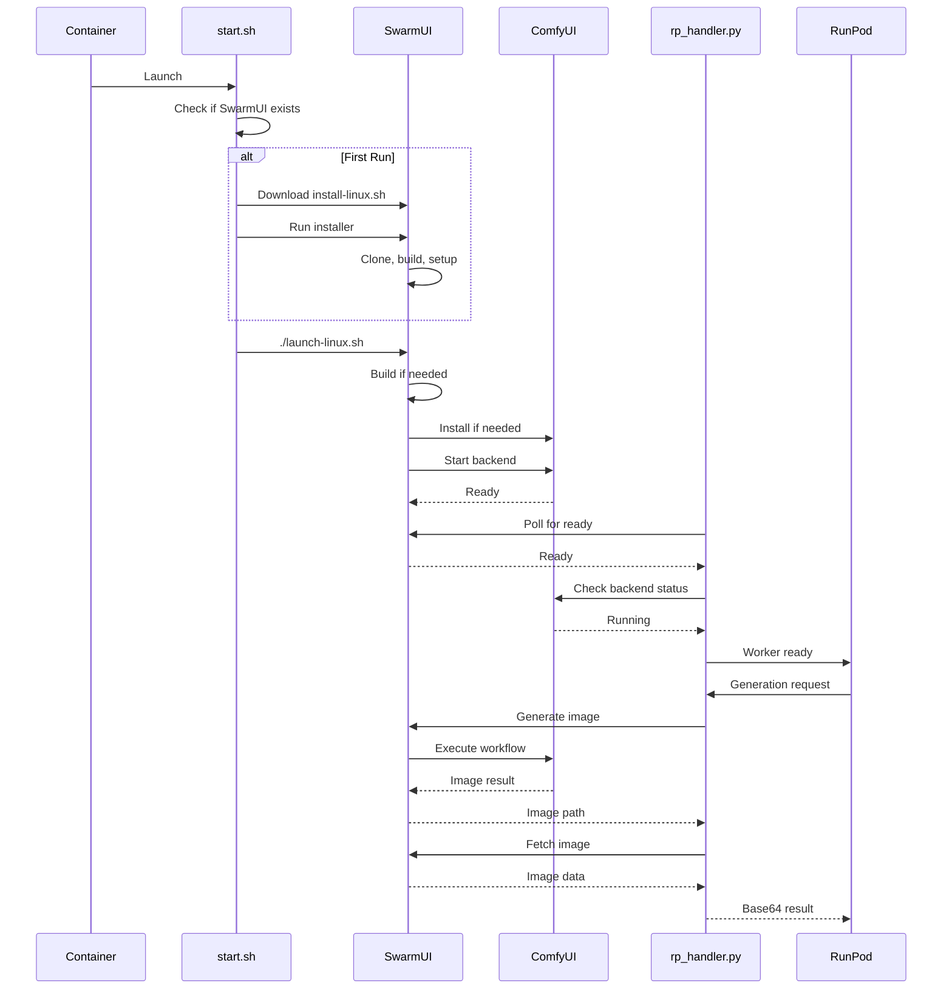

# RunPod SwarmUI Serverless Worker

**Production-ready SwarmUI on RunPod Serverless** using official SwarmUI installation scripts.

<p align="center">
  <a href="#quick-start">Quick Start</a> ·
  <a href="#how-it-works">How It Works</a> ·
  <a href="#features">Features</a> ·
  <a href="#documentation">Docs</a>
</p>

---

## 🎯 Key Features

- **Official SwarmUI Scripts** – Uses SwarmUI's `install-linux.sh` and `launch-linux.sh` (no reinventing the wheel)
- **Automatic ComfyUI** – SwarmUI installs and manages ComfyUI backend automatically
- **Persistent Storage** – Everything saved to RunPod network volume
- **Zero Idle Cost** – Pay only when generating (0 active workers)
- **Fast After First Run** – First run: 15-20 min, subsequent: 60-90s

---

## 🚀 Quick Start

### 1. Create Network Volume

```bash
# Go to: https://runpod.io/console/storage
# Click: "+ New Network Volume"
# Settings:
#   - Name: swarmui-storage
#   - Size: 100GB minimum (200GB recommended)
#   - Datacenter: EU-RO-1 or US-GA
```

### 2. Deploy Endpoint

```bash
# Go to: https://runpod.io/console/serverless
# Click: "+ New Endpoint"
# Settings:
#   - Container Image: yourusername/swarmui-runpod:latest
#   - GPU: RTX 4090 (24GB) recommended
#   - Active Workers: 0
#   - Max Workers: 3
#   - Idle Timeout: 120s
#   - Network Volume: swarmui-storage
#   - Container Disk: 20GB
```

### 3. Wait for First Installation

**First run timeline:**
- Download SwarmUI installer: 30s
- Install SwarmUI: 2-3 minutes
- Build SwarmUI: 3-5 minutes
- Install ComfyUI: 5-10 minutes
- **Total: 15-20 minutes**

**Subsequent runs: 60-90 seconds** (just startup, no installation)

### 4. Test It

```bash
python tests/test_endpoint.py \
  --endpoint YOUR_ENDPOINT_ID \
  --api-key YOUR_RUNPOD_API_KEY
```

---

## 🏗️ How It Works

### The Smart Approach

Instead of manually managing SwarmUI installation, we use SwarmUI's **official installation scripts**:

1. **First Run:**
   ```bash
   # start.sh downloads and runs SwarmUI's official installer
   wget https://github.com/mcmonkeyprojects/SwarmUI/releases/download/0.6.5-Beta/install-linux.sh
   ./install-linux.sh
   
   # Then launches SwarmUI (which auto-installs ComfyUI)
   ./launch-linux.sh --launch_mode none --host 0.0.0.0
   ```

2. **Subsequent Runs:**
   ```bash
   # start.sh just launches SwarmUI
   ./launch-linux.sh --launch_mode none --host 0.0.0.0
   ```

3. **SwarmUI Handles:**
   - Building itself if needed
   - Installing ComfyUI backend if needed
   - Starting ComfyUI backend automatically
   - Managing all dependencies

4. **We Just:**
   - Wait for SwarmUI to be ready
   - Wait for ComfyUI backend to start
   - Handle generation requests

**Why This Is Better:**
- ✅ Uses tested, official installation process
- ✅ Automatically gets SwarmUI updates
- ✅ ComfyUI managed by SwarmUI (proper integration)
- ✅ Less custom code = fewer bugs
- ✅ Easier to maintain and update

### Architecture Flow



### Network Volume Layout

```
/runpod-volume/
├── SwarmUI/                    # Installed by install-linux.sh
│   ├── launch-linux.sh         # Official launcher
│   ├── src/                    # SwarmUI source
│   ├── bin/                    # Built binaries
│   ├── Data/                   # Settings
│   ├── dlbackend/              # ComfyUI (installed by SwarmUI)
│   │   └── ComfyUI/
│   ├── Models -> ../Models/    # Symlink to volume
│   └── Output -> ../Output/    # Symlink to volume
├── Models/                     # Persistent models
│   ├── Stable-Diffusion/
│   ├── Loras/
│   └── VAE/
└── Output/                     # Generated images
```

---

## 📖 Documentation

- **[Quick Start](docs/QUICKSTART.md)** – Get running in 15 minutes
- **[Setup Guide](docs/SETUP.md)** – Detailed deployment instructions
- **[Architecture](docs/ARCHITECTURE.md)** – Technical design
- **[Troubleshooting](docs/TROUBLESHOOTING.md)** – Common issues

---

## 💰 Cost Estimate

### GPU Costs
- RTX 4090 (24GB): $0.68/hour
- A100 (40GB): $2.48/hour
- A100 (80GB): $3.56/hour

### Storage
- 100GB network volume: $7/month

### Example Usage
```
RTX 4090 + 100GB storage
10 seconds per image
100 images/day = 17 minutes/day
Monthly: ~$6 GPU + $7 storage = $13/month

With 0 active workers: No idle costs!
```

---

## 🔧 Configuration

### Environment Variables

```bash
# SwarmUI Server
SWARMUI_HOST=0.0.0.0
SWARMUI_PORT=7801

# Network Volume
VOLUME_PATH=/runpod-volume

# Timeouts
STARTUP_TIMEOUT=1800      # 30 min for first install
GENERATION_TIMEOUT=600    # 10 min per generation
```

### API Input Format

```json
{
  "input": {
    "prompt": "a beautiful landscape",
    "negative_prompt": "low quality, blurry",
    "model": "OfficialStableDiffusion/sd_xl_base_1.0",
    "width": 1024,
    "height": 1024,
    "steps": 30,
    "cfg_scale": 7.5,
    "seed": -1,
    "images": 1
  }
}
```

### API Response Format

```json
{
  "output": {
    "images": [
      {
        "filename": "image.png",
        "type": "base64",
        "data": "iVBORw0KGgo..."
      }
    ],
    "parameters": {
      "prompt": "a beautiful landscape",
      "model": "...",
      "seed": 1234567890,
      "width": 1024,
      "height": 1024
    }
  }
}
```

---

## 🔍 Troubleshooting

### First Start Taking Too Long?

**This is normal!** First installation takes 15-20 minutes:
- SwarmUI download and build: 5 minutes
- ComfyUI installation: 5-10 minutes
- Python dependencies: 2-5 minutes

**Watch the logs** to see progress.

### "Service Not Ready" Error?

Wait 60-90 seconds for cold start. The worker needs to:
1. Start SwarmUI server (30s)
2. Start ComfyUI backend (30-60s)
3. Load models to VRAM (if used before)

### Models Not Found?

Upload models to the network volume:
```bash
# Start a GPU Pod with your network volume
# Models go in: /workspace/Models/Stable-Diffusion/
# (network volume mounts at /workspace in Pods)
```

### Want to Use a Specific SwarmUI Version?

Edit `scripts/start.sh` and change the version:
```bash
wget https://github.com/mcmonkeyprojects/SwarmUI/releases/download/VERSION/install-linux.sh
```

---

## 📁 Repository Structure

```
runpod-swarmui-serverless/
├── Dockerfile              # Container with prereqs only
├── scripts/
│   └── start.sh           # Downloads and runs SwarmUI installers
├── src/
│   └── rp_handler.py      # RunPod handler (waits for ready, generates)
├── builder/
│   └── requirements.txt   # Python deps (runpod, requests)
├── tests/
│   └── test_endpoint.py   # Test script
└── docs/                  # Documentation
```

**Key Philosophy:** Let SwarmUI do what it does best. We just provide the environment and wait for it to be ready.

---

## 🤝 Contributing

This project follows best practices:
- Uses official installation methods (no custom hacks)
- Minimal custom code (easier to maintain)
- Well-documented and tested
- Professional error handling

Contributions welcome! Please maintain this philosophy.

---

## 📄 License

MIT License - see [LICENSE](LICENSE)

---

## 🙏 Acknowledgments

- **SwarmUI Team** – For excellent installation scripts and API
- **ComfyUI Team** – For the powerful backend
- **RunPod** – For the serverless platform

---

## 📞 Support

- **GitHub Issues**: [Report bugs](https://github.com/YOUR_USERNAME/runpod-swarmui-serverless/issues)
- **SwarmUI Discord**: [Join](https://discord.gg/q2y38cqjNw)
- **RunPod Discord**: [Join](https://discord.gg/runpod)

---

**Ready to deploy?** Just create a network volume, deploy the endpoint, and wait for the first installation. That's it! 🚀
