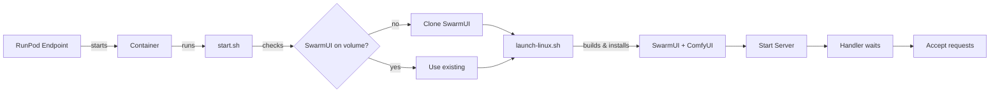

# RunPod SwarmUI Serverless Worker

**Production-ready SwarmUI on RunPod Serverless** - Deploy powerful AI image generation with persistent storage and pay-per-use pricing.

<p align="center">
  <a href="#quick-start">Quick Start</a> ·
  <a href="#features">Features</a> ·
  <a href="#requirements">Requirements</a> ·
  <a href="#documentation">Docs</a> ·
  <a href="#architecture">Architecture</a>
</p>

---

## 🎯 Highlights

- **Serverless Architecture** – Built on RunPod's serverless platform with automatic scaling
- **Persistent Storage** – Full SwarmUI installation on network volume, models persist across workers
- **Production Ready** – Professional code following best practices, comprehensive error handling
- **Cost Effective** – Pay only when generating, $0 when idle (0 active workers)
- **Full SwarmUI** – Complete SwarmUI with ComfyUI backend, all features available

---

## ✨ Features

- **Automatic Installation** – First run installs SwarmUI + ComfyUI to network volume (~20 min)
- **Fast Subsequent Starts** – Reuses existing installation (~60-90s cold start)
- **Session Management** – Proper SwarmUI session handling for reliable generation
- **Base64 Images** – Returns images as base64 for easy integration
- **Comprehensive Testing** – Included test scripts for both sync and async endpoints
- **CI/CD Ready** – GitHub Actions workflow for automated Docker builds

---

## 📋 Requirements

### RunPod Account
- Active RunPod account with credits ($10 minimum recommended)
- RunPod API key (for testing)

### Network Volume
- **Required**: RunPod network volume
- **Minimum Size**: 50GB (basic), 100GB (recommended), 500GB+ (extensive models)
- **Purpose**: Stores SwarmUI installation, ComfyUI backend, models, outputs
- **Cost**: ~$7/month for 100GB

### GPU Selection
- **RTX 4090 (24GB)**: Best for SDXL - $0.00019/second (~$0.68/hour)
- **A100 (40GB)**: Large models - $0.00069/second (~$2.48/hour)
- **A100 (80GB)**: Multiple large models - $0.00099/second (~$3.56/hour)

> ⚠️ **Network volume is required** – Without it, every cold start re-installs everything (20+ minutes)

---

## 🚀 Quick Start

### 1. Create Network Volume
```bash
# Go to: https://runpod.io/console/storage
# Click: "+ New Network Volume"
# Configure:
#   - Name: swarmui-models
#   - Size: 100GB minimum
#   - Datacenter: EU-RO-1 or US-GA
# Click: "Create"
```

### 2. Deploy Docker Image

**Option A: Use Pre-built Image** (easiest)
```
yourusername/swarmui-runpod:latest
```

**Option B: Build Your Own**
```bash
git clone https://github.com/YOUR_USERNAME/runpod-swarmui-serverless.git
cd runpod-swarmui-serverless

# Build for linux/amd64
docker build --platform linux/amd64 -t yourusername/swarmui-runpod:latest .

# Push to Docker Hub
docker push yourusername/swarmui-runpod:latest
```

### 3. Create RunPod Endpoint

```bash
# Go to: https://runpod.io/console/serverless/user/endpoints
# Click: "+ New Endpoint"
# Configure:
#   - Container Image: yourusername/swarmui-runpod:latest
#   - GPU: RTX 4090 (24GB)
#   - Active Workers: 0 (pay only when used)
#   - Max Workers: 3
#   - Idle Timeout: 120s
#   - Network Volume: swarmui-models
#   - Container Disk: 15GB
# Click: "Deploy"
```

### 4. Wait for First Install

**First startup timeline:**
- Container initialization: 30s
- SwarmUI clone and build: 5-10min
- ComfyUI installation: 5-10min
- Ready to use: **~20 minutes total**

**Subsequent startups:**
- Cold start: 60-90 seconds
- Warm worker: Instant

### 5. Test Your Endpoint

```bash
# Install test dependencies
pip install requests

# Test the endpoint
python tests/test_endpoint.py \
  --endpoint YOUR_ENDPOINT_ID \
  --api-key YOUR_RUNPOD_API_KEY

# With custom prompt
python tests/test_endpoint.py \
  --endpoint YOUR_ENDPOINT_ID \
  --api-key YOUR_RUNPOD_API_KEY \
  --prompt "a majestic dragon"

# Async mode
python tests/test_endpoint.py \
  --endpoint YOUR_ENDPOINT_ID \
  --api-key YOUR_RUNPOD_API_KEY \
  --async
```

Images will be saved to `./output/` directory.

---

## 📖 Documentation

- **[Quick Start](docs/QUICKSTART.md)** – Get running in 10 minutes
- **[Setup Guide](docs/SETUP.md)** – Comprehensive deployment instructions
- **[Deployment Checklist](docs/DEPLOYMENT_CHECKLIST.md)** – Step-by-step validation
- **[Architecture](docs/ARCHITECTURE.md)** – Technical details and design
- **[Troubleshooting](docs/TROUBLESHOOTING.md)** – Common issues and solutions
- **[File Structure](FILE_STRUCTURE.md)** – Complete repository layout

---

## 🏗️ Architecture

### How It Works



**Key Point**: We use SwarmUI's **own** `launch-linux.sh` script which handles everything:
- Building SwarmUI (if needed)
- Installing ComfyUI backend automatically (if needed)
- Starting the server

This is much simpler and more reliable than custom installation logic!

### Network Volume Layout

```
/runpod-volume/
├── SwarmUI/              # Full installation
│   ├── bin/              # Built binaries
│   ├── Data/             # Settings
│   ├── dlbackend/        # ComfyUI backend
│   │   └── comfy/ComfyUI/
│   ├── Models/           # Symlink to volume
│   └── Output/           # Symlink to volume
├── Models/               # Persistent models
│   ├── Stable-Diffusion/
│   ├── Loras/
│   └── VAE/
└── Output/               # Generated images
```

---

## 💰 Cost Estimate

### GPU Costs (per hour)
- RTX 4090: $0.68/hour
- A100 40GB: $2.48/hour
- A100 80GB: $3.56/hour

### Storage Costs (per month)
- 50GB: $3.50/month
- 100GB: $7.00/month
- 500GB: $35.00/month

### Example Usage
```
RTX 4090 (24GB) + 100GB storage

Generation time: 10 seconds per image
Daily usage: 100 images = ~17 minutes
Monthly GPU cost: ~$6
Monthly storage: $7
Total: ~$13/month

With 0 active workers: No idle costs!
```

---

## 🔧 Configuration

### Environment Variables

See `.env.example` for all options:

```bash
SWARMUI_HOST=0.0.0.0
SWARMUI_PORT=7801
VOLUME_PATH=/runpod-volume
GENERATION_TIMEOUT=600
STARTUP_TIMEOUT=900
```

### API Input Format

```json
{
  "input": {
    "prompt": "a beautiful landscape",
    "negative_prompt": "low quality",
    "model": "OfficialStableDiffusion/sd_xl_base_1.0",
    "width": 1024,
    "height": 1024,
    "steps": 30,
    "cfg_scale": 7.5,
    "seed": -1,
    "images": 1
  }
}
```

### API Response Format

```json
{
  "output": {
    "images": [
      {
        "filename": "image.png",
        "type": "base64",
        "data": "iVBORw0KGgoAAAANS..."
      }
    ],
    "parameters": {
      "prompt": "a beautiful landscape",
      "model": "OfficialStableDiffusion/sd_xl_base_1.0",
      "seed": 1234567890,
      "width": 1024,
      "height": 1024,
      "steps": 30,
      "cfg_scale": 7.5
    }
  }
}
```

---

## 📁 Repository Structure

```
runpod-swarmui-serverless/
├── Dockerfile                    # Container definition
├── scripts/start.sh              # SwarmUI installer
├── src/rp_handler.py             # RunPod handler
├── builder/requirements.txt      # Python deps
├── tests/                        # Test scripts
├── docs/                         # Documentation
├── .github/workflows/            # CI/CD
└── README.md                     # This file
```

See [FILE_STRUCTURE.md](FILE_STRUCTURE.md) for complete details.

---

## 🔍 Troubleshooting

### Common Issues

**Issue**: First start takes too long
- **Expected**: 20-30 minutes for first installation
- **Solution**: Be patient, subsequent starts are 60-90s

**Issue**: "Service not ready"
- **Cause**: SwarmUI still starting up
- **Solution**: Wait 60-90 seconds for cold start

**Issue**: "Network volume not mounted"
- **Cause**: No network volume attached
- **Solution**: Attach network volume in endpoint settings

**Issue**: "Model not found"
- **Cause**: Model not on network volume
- **Solution**: Upload models to `/runpod-volume/Models/Stable-Diffusion/`

See [TROUBLESHOOTING.md](docs/TROUBLESHOOTING.md) for complete guide.

---

## 🤝 Contributing

Contributions welcome! Please:
1. Read the code - it's production quality with best practices
2. Follow the existing code style
3. Test your changes thoroughly
4. Submit a PR with clear description

---

## 📄 License

MIT License - see [LICENSE](LICENSE) file for details.

---

## 🙏 Acknowledgments

- **SwarmUI Team** – For the amazing UI and API
- **ComfyUI Team** – For the powerful backend
- **RunPod** – For the serverless platform
- **Community** – For feedback and testing

---

## 📞 Support

- **GitHub Issues**: [Report bugs](https://github.com/YOUR_USERNAME/runpod-swarmui-serverless/issues)
- **SwarmUI Discord**: [Join here](https://discord.gg/q2y38cqjNw)
- **RunPod Discord**: [Join here](https://discord.gg/runpod)

---

**Ready to deploy?** Follow the [Quick Start](#quick-start) above! 🚀