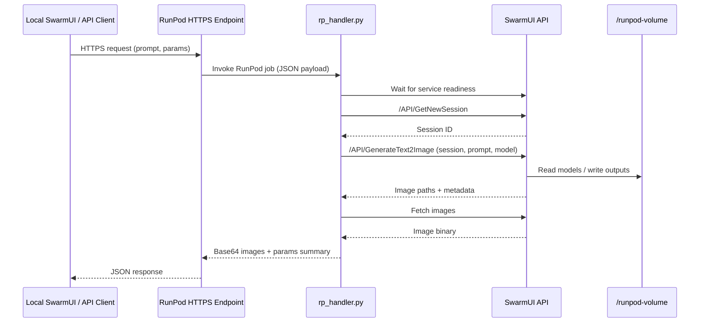

# Architecture Overview

This document explains how the RunPod SwarmUI Serverless worker initializes, handles requests, and persists data.

---

## High-Level Components

- **Docker Image** (`Dockerfile`)
  - Installs system dependencies, .NET 8 SDK, Python 3.11, and the RunPod handler requirements.
  - Copies `start.sh` and `src/rp_handler.py` into the container.
  - Entrypoint launches `start.sh` in the background and then runs the Python handler.

- **Startup Script** (`start.sh`)
  - Checks for a mounted RunPod network volume at `/runpod-volume` (configurable via `VOLUME_PATH`).
  - Installs SwarmUI and its ComfyUI backend onto the network volume if not already present.
  - Symlinks model/output directories to the network volume for persistence.
  - Launches the SwarmUI server (`dotnet bin/SwarmUI.dll`) listening on `0.0.0.0:7801` by default.

- **Handler** (`src/rp_handler.py`)
  - Waits for the SwarmUI REST API to become available.
  - For each RunPod job, obtains a session ID, submits the generation request, polls for output images, and returns base64 results.
  - Implements automatic retries and detailed logging to aid debugging.

- **Test Utilities** (`test_endpoint.py`, `test_input.json`)
  - Provide reference payloads and scripts to validate synchronous (`/runsync`) and asynchronous (`/run`) RunPod API calls.

---

## Request Flow



---

## Network Volume Layout

All persistent data lives under `/runpod-volume` (configurable via `VOLUME_PATH`).

```
/runpod-volume/
├── SwarmUI/                # Application binaries and Data/ folder
│   ├── bin/                # Built SwarmUI binaries
│   ├── Data/               # Settings and server metadata
│   ├── dlbackend/ComfyUI/  # Installed ComfyUI backend
│   └── Output/             # Generation outputs (symlink target)
├── Models/                 # User-provided models and assets
│   ├── Stable-Diffusion/
│   ├── Loras/
│   ├── VAE/
│   ├── Embeddings/
│   └── ControlNet/
└── Output/                 # Centralized output directory (symlink target)
```

Key behaviors:
- First run clones and builds SwarmUI directly into `/runpod-volume/SwarmUI`.
- Subsequent cold starts reuse the existing installation, reducing startup time.
- Models uploaded once remain accessible to every serverless worker.

---

## Environment Variables

| Variable | Default | Description |
|----------|---------|-------------|
| `VOLUME_PATH` | `/runpod-volume` | Root path for the network volume |
| `SWARMUI_HOST` | `0.0.0.0` | Bind address for SwarmUI server |
| `SWARMUI_PORT` | `7801` | Port for SwarmUI REST API |
| `STARTUP_TIMEOUT` | `600` | Seconds to wait for SwarmUI readiness (set via RunPod env if needed) |
| `TIMEOUT` (handler) | `600` | Per-request timeout for image generation |

Additional environment variables can be added via RunPod template settings to customize dimensions, default models, or logging—update `start.sh` and `rp_handler.py` accordingly if you expose more options.

---

## Cold Start Behavior

1. Container starts and immediately executes `/start.sh & python3 -u /rp_handler.py`.
2. `start.sh` ensures the volume is mounted, installs SwarmUI/ComfyUI if needed, then runs SwarmUI.
3. The Python handler waits until `http://127.0.0.1:7801/API/GetNewSession` responds.
4. RunPod marks the worker ready and begins routing incoming jobs.

**First boot** can take 20–30 minutes (clone + build + ComfyUI install). Subsequent boots typically take 1–2 minutes.

---

## Scaling & Sessions

- Each worker handles one job at a time; RunPod scales horizontally up to your configured max workers.
- SwarmUI sessions are acquired per request to isolate settings; the handler cleans up on completion.
- Multiple workers share the same network volume, so model downloads happen once and are reused.

---

## Extending the Worker

Ideas for future enhancements:

- Add health endpoints or metrics exporters for observability.
- Preconfigure model download scripts (e.g., via environment variables listing URLs).
- Support additional SwarmUI endpoints beyond text-to-image (image-to-image, workflows, etc.).
- Integrate with storage services (S3, GCS) for automatic upload of generated images.

Contributions are welcome. Open a PR or issue if you implement new features.
