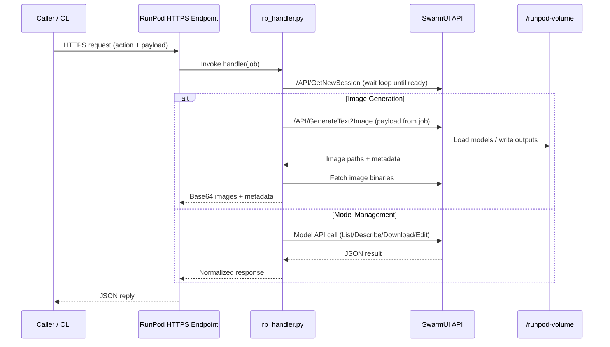

# Architecture Overview

This document explains how the RunPod SwarmUI Serverless worker boots, serves requests, and persists data after the latest refactors.

---

## High-Level Components

- **Container Image** (`Dockerfile`)
  - Installs system dependencies, Python 3.11, and handler requirements from `builder/requirements.txt`.
  - Copies `start.sh` and `src/rp_handler.py` into the image.
  - Entrypoint backgrounds `start.sh` to launch SwarmUI and then starts the Python handler.

- **Startup Script** (`scripts/start.sh`)
  - Validates that a RunPod network volume is mounted at `VOLUME_PATH` (default `/runpod-volume`).
  - Installs SwarmUI and the ComfyUI backend onto the volume on first boot; subsequent boots reuse the installation.
  - Invokes SwarmUI’s official `launch-linux.sh` with the configured host and port.

- **Handler** (`src/rp_handler.py`)
  - Establishes a shared `requests.Session` with retry logic.
  - Exposes helper functions for SwarmUI model APIs (`/API/ListModels`, `/API/DescribeModel`, `/API/DoModelDownloadWS`, `/API/EditModelMetadata`).
  - Implements image generation via `/API/GenerateText2Image`, including payload normalization, error handling, and image fetching.
  - Provides a keep-alive action that repeatedly pings `/API/GetNewSession` to keep GPUs warm for custom workflows.

- **Testing Utilities** (`tests/`)
  - `tests/test_endpoint.py` – sync smoke test for `/runsync` image generation.
  - `tests/test_model_management.py` – CLI wrapper for model list/describe/download/edit and keep-alive.
  - `tests/test_storage.py` – S3 inventory helper for the RunPod network volume.
  - `tests/test_handler.py` – unit tests for core handler helpers.

---

## Request Flow



---

## Data & Persistence

All persistent assets live on the RunPod network volume so each cold start reuses prior installs and models.

```
/runpod-volume/
├── SwarmUI/
│   ├── launch-linux.sh, bin/, Data/, dlbackend/
│   └── Output/            ← symlink target for generated images
├── Models/                ← user-provided models (Stable-Diffusion, Flux, etc.)
└── Output/                ← canonical output folder exposed to users
```

Key behaviors:
- First boot clones and installs SwarmUI into `/runpod-volume/SwarmUI`.
- ComfyUI backend is placed under `SwarmUI/dlbackend/ComfyUI/` once.
- Model downloads (manual or via `tests/test_model_management.py download`) persist on the volume for future workers.

---

## Environment Variables

`src/rp_handler.py` and helper scripts expect the variables below. Defaults for documentation mirror `.env.example`.

| Variable | Default | Purpose |
|----------|---------|---------|
| `SWARMUI_API_URL` | `http://127.0.0.1:7801` | Internal URL used by the handler to reach SwarmUI |
| `STARTUP_TIMEOUT` | `1800` | Seconds to wait for SwarmUI readiness during cold start |
| `GENERATION_TIMEOUT` | `600` | Timeout (seconds) for `/API/GenerateText2Image` calls |
| `HUGGINGFACE_API_TOKEN` | _(unset)_ | Passed to SwarmUI for gated model downloads |
| `RUNPOD_ENDPOINT_ID` | _(unset)_ | Used by test scripts when omitted from CLI flags |
| `RUNPOD_API_TOKEN` | _(unset)_ | API key for invoking the serverless endpoint |
| `RUNPOD_ENDPOINT_URL` | _(unset)_ | S3-style endpoint for RunPod volumes (used by scripts/tests) |
| `RUNPOD_ACCESS_KEY` / `RUNPOD_SECRET_ACCESS_KEY` | _(unset)_ | Credentials for RunPod S3 uploads |
| `RUNPOD_TRAINING_STORAGE_REGION` | _(unset)_ | Region for RunPod storage operations |
| `RUNPOD_TRAINING_STORAGE_VOLUME_ID` | _(unset)_ | Bucket/volume identifier for S3 uploads |
| `RUNPOD_S3_PREFIX` | `""` | Optional prefix when storing models via S3 |

`scripts/start.sh` also respects `SWARMUI_HOST`, `SWARMUI_PORT`, and `VOLUME_PATH`. Adjust these via RunPod environment settings when customizing the deployment template.

---

## Cold Start Timeline

1. Container boots and executes `/start.sh` (foreground) and `python3 -u /rp_handler.py` (foreground).
2. `start.sh` installs SwarmUI + ComfyUI on first run, then launches SwarmUI listening on the configured host/port.
3. The handler polls `/API/GetNewSession` until SwarmUI is ready, optionally performing a zero-image warm-up call.
4. Once ready, RunPod begins forwarding jobs. Warm boots typically reach readiness within 60–90 seconds; first install can take 20–30 minutes depending on network volume speed.

---

## Scaling, Sessions, and Keep-Alive

- Each RunPod worker processes one job at a time. Scale horizontally by increasing "Max Workers" in your endpoint.
- Handler obtains a unique SwarmUI session per request through `get_session_id()` so requests stay isolated.
- The `keep_alive` action keeps a worker awake by pinging `/API/GetNewSession` at a configurable interval—useful for chaining manual API calls after a warm-up.
- Shared network volume means multiple workers reuse identical model assets without re-downloading.

---

## Tests & Tooling

- `tests/test_endpoint.py` provides a synchronous `/runsync` smoke test that stores returned images.
- `tests/test_model_management.py` exposes CLI subcommands mirroring the handler’s model actions plus the keep-alive workflow.
- `tests/test_storage.py` lists models stored in RunPod S3 using the configured credentials.
- `tests/test_handler.py` contains unit tests for session management and payload preparation.

These scripts are the reference implementations for API usage and should be kept in sync with handler changes.

---

## Extensibility Roadmap

- Add additional SwarmUI endpoints (image-to-image, workflows) by following the pattern in `rp_handler.py`.
- Wire structured logging/metrics to external observability stacks.
- Expand `tests/` with integration checks (e.g., verifying model metadata updates propagate correctly).
- Publish supplemental scripts for automated model synchronization or bulk downloads.

Contributions welcome—open an issue or PR with improvements.
